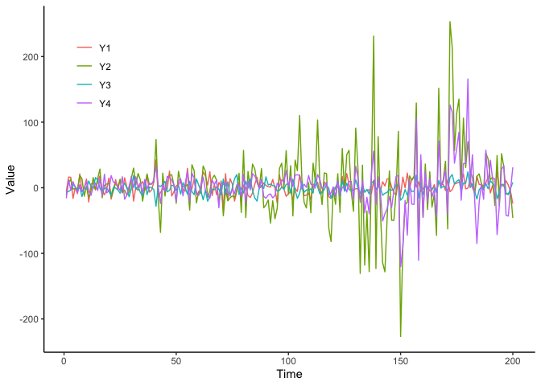
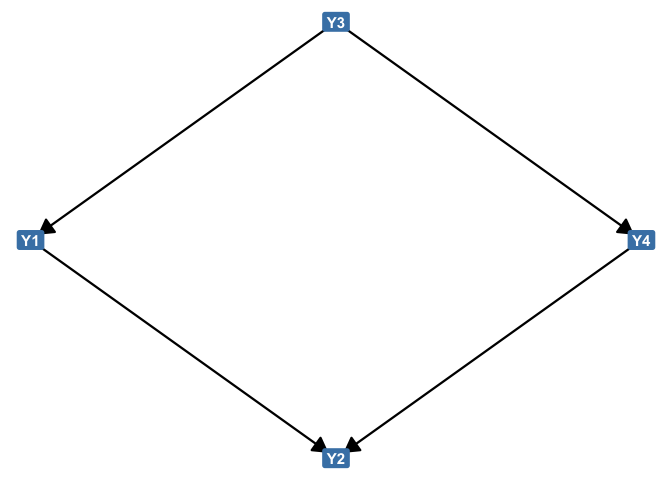
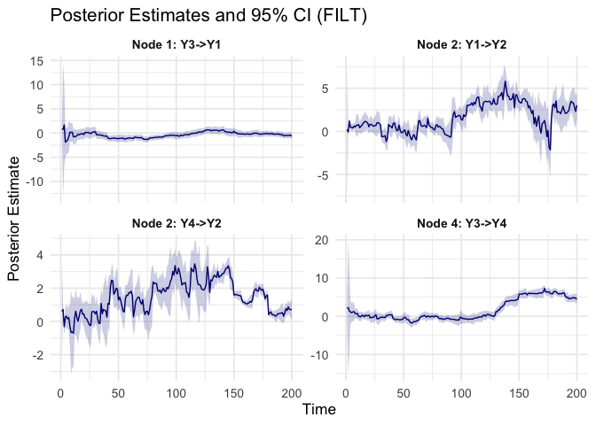
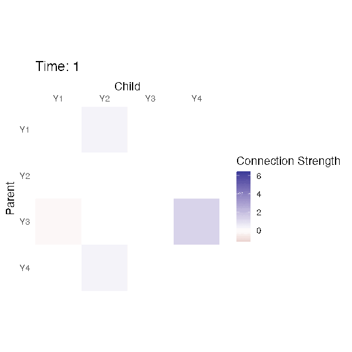
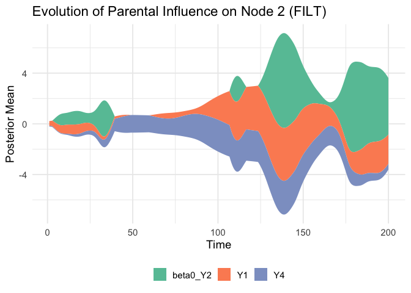
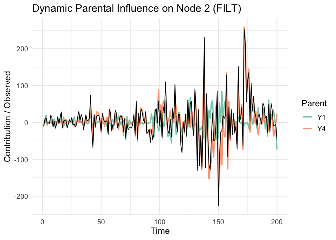

# MDMr: Bayesian Network Modeling for Dynamic Multivariate Time Series

**MDMr** is an R package for learning the structure and estimating the
dynamic parameters of Bayesian networks from multivariate time series.
It integrates structure learning algorithms including `bnlearn::hc` and
IPA -
[`GOBNILP`](https://bitbucket.org/jamescussens/gobnilp/src/master/) with
Kalman filtering and smoothing to estimate time-varying parameters for
each node.

## Installation

You can install the development version of mdmr from
[GitHub](https://github.com/arzevedo/mdmr) with:

``` r
# Install dependencies (if not already installed)
install.packages(c("bnlearn", "ggplot2", "ggstream", "magick", "Rcpp", "reticulate"))

# Then install MDMr from github
if(!require("devtools")){
  install.packages("devtools") 
}
devtools::install_github("arzevedo/mdmr")
```

------------------------------------------------------------------------

## Example Usage

This walkthrough demonstrates how to use `MDMr` to learn a dynamic
bayesian network and visualize the results. This is a example
multivariate time series data \[200 x 4\]

### 1. Load the package and sample data

``` r
library(mdmr)
```

``` r
head(mdmr::y)
#>            Y1         Y2        Y3         Y4
#> 1  -6.1321001 -11.210444 -7.283991 -16.075637
#> 2  16.2922322   7.415729 -5.656067  12.150740
#> 3  15.9534579  13.000213 -3.744846  -3.317547
#> 4 -16.3264156  -1.952344  4.994592   9.167856
#> 5   0.3482551  -1.353144  1.710518   0.384896
#> 6  -9.1254934  -2.152148 -3.419737  -7.484200
long_df <- stack(mdmr::y)
long_df$obs <- rep(seq_len(nrow(mdmr::y)), times = ncol(mdmr::y))
names(long_df) <- c("Value", "name", "Time")
long_df |> 
  ggplot2::ggplot(ggplot2::aes(x=Time,y=Value,colour=name))+
  ggplot2::geom_line()+ ggplot2::theme_classic()+
  ggplot2::theme(legend.position=c(.1,.8),legend.title = ggplot2::element_blank())
```



### 2. Fit the MDM model

``` r
res <- mdm(data_input = y, method = "hc")
#> Running hill-climbing with custom MDM score...
```

- `res` is an object of class `"mdm"` containing:
  - The inferred DAG structure
  - Filtering and smoothing estimates
  - Local scores and optimization metadata
  - Currently the availiable methods are
    “hc”/“tabu”/“mmhc”/“h2pc”/“rsmax2” structure learning using the
    `bnlearn` package and “ipa”: Integer Programming Approach using
    GOBNILP with Jaakkola scoring.

------------------------------------------------------------------------

### 3. Visualizations

#### 3.1 DAG Structure

``` r
plot_dag(res, type = "graph")
```



> Displays the structure as a directed acyclic graph with nodes and
> directed edges.

- The `type` arguments selects the plot to display. Either “graph” for a
  directed acyclic graph with arrows or “heatmap” for a matrix view.
- There are other arguments to personalize the graph output like
  `edge_color`, and `node_labels`.

#### 3.2 Arcs Over Time

Highlight which arcs were selected and their local scores

``` r
plot_arcs(res, type = "connections", distribution = "filt", ci_level = 0.95)
```



> Helps identify dominant parent-child relationships.

- The `type` argument selects the dynamic parameters time series that
  are displayed.
  - “connections”: Plots only dynamic edge parameters (e.g., V3-\>V1).
  - “intercepts”: Plots only intercepts (e.g., beta0 terms).
  - “all”: Plots both intercepts and connections.
- The `distribution` argument defines whether to use filtered (“filt”)
  or smoothed (“smoo”) distributions. Default is “filt”.
- The `ci_level` argument establish the width of the credible interval.
  Default is 0.95.

#### 3.3 Dynamic Heatmap Animation

Animated heatmap of posterior estimates across time using `magick`
package.

``` r
plot_idag(mdm_object=res, output_gif = "my_dynamic_model.gif", fps = 10, width = 6,
          height = 6, dpi=100)
```



> Each tile represents the magnitude of a dynamic parameter at each time
> step. This animation captures the temporally varying intensity of
> connections in the network structure.

- The `mdm_object` argument requires an object of class “mdm” as
  returned by `mdm`.
- `output_gif` is the name of the output file. Must end with “.gif”.
  Default is “mdm.gif”.
- `fps` selects the frames per second for the animation. Default is 10.
- `width` (in inches) of each frame. Default is 6.
- `height` (in inches) of each frame. Default is 6.
- `dpi` is the resolution (dots per inch) for saved frames. Default is
  150.

#### 3.4 Streamplot for a Node

Plot contribution of parents to the dynamic evolution of a target node
using the `ggstream` package.

``` r
plot_stream(mdm_object=res, child_node=2, distribution = "filt")
```



> Useful for assessing how different parents dynamically influence a
> given node.

- The `mdm_object` argument requires an object of class “mdm” as
  returned by `mdm`.
- The `child_node` argument is an integer index of the target node
  (i.e., the child whose parents’ effects are shown).
- The `distribution` arguments defines whether to use filtered (“filt”)
  or smoothed (“smoo”) posterior estimates. Default is “filt”.

#### 3.5 Marginal Posterior for a Node

Plot the marginal posterior means and confidence bands.

``` r
plot_marginal(mdm_object = res, distribution = "filt", target_node = 2,
              scale_series = FALSE)
```



> Shows how the coefficients associated with a node evolve over time
> (filtered or smoothed).

- The `mdm_object` argument requires an object of class “mdm” as
  returned by `mdm`.
- The `target_node` argument is a integer index specifying the target
  node (child).
- The `distribution` arguments defines whether to use filtered (“filt”)
  or smoothed (“smoo”) posterior estimates. Default is “filt”.
- The `scale_series` argument is a logical value. If TRUE, all time
  series (observed and parental contributions) are standardized (mean
  zero, unit variance). Default is FALSE.

------------------------------------------------------------------------

## Structure Learning Backends

By default, the `mdm()` function uses the hill-climbing algorithm from
the `bnlearn` package to learn the structure of the Bayesian network.
Other heuristic methods are also available, like Tabu search, Max-Min
Hill-Climbing, H2PC, and RSMAX2 from the same package.

If you prefer to use the Integer Programming Approach (IPA) via GOBNILP,
make sure to:

1.  Properly install [**SCIP**](https://www.scipopt.org/) on your
    machine.
2.  Compile and install the
    [**GOBNILP**](https://bitbucket.org/jamescussens/gobnilp/src/master/)
    binary.
3.  Set the binary path in R using:

``` r
options(gobnilp.path = "/full/path/to/gobnilp")
```

This enables `mdmr` to use `GOBNILP` for structure optimization via the
`run_gobnilp()` interface.
